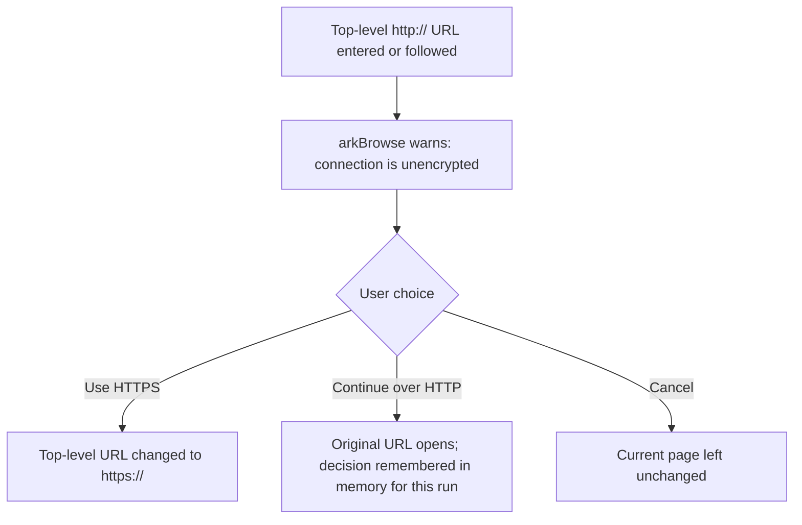

<p align="center">
  
</p>

<p align="center">
  
  
  
  
  
</p>

<h1 align="center">arkBrowse</h1>

<p align="center">
arkBrowse is a fast, privacy-first desktop browser built with PyQt6 and
QtWebEngine (Chromium). The application remains a single Python file, with a
small set of bundled assets and no database.
</p>

---

## 📑 Table of Contents
- [What changed in this build](#-what-changed-in-this-build)
- [Run from source on Windows](#-run-from-source-on-windows)
- [Preferences and privacy](#-preferences-and-privacy)
- [Search and start page](#-search-and-start-page)
- [Build `arkBrowse.exe`](#-build-arkbrowseexe)
- [Verification](#-verification)
- [Honest limitations](#-honest-limitations)
- [Author & Contact](#-author--contact)
- [License](#-license)

---

## 🔄 What changed in this build

- **Safe normal multi-window support.** Ctrl+N and the new-window toolbar
  action open normal windows on one application-owned, off-the-record
  `QWebEngineProfile`. A window can close without destroying another window's
  pages or profile.
- **No browsing-data persistence.** Normal and incognito profiles are
  memory-only. Cookies are non-persistent, cache is memory-backed, and
  history, downloads, form data, and page storage disappear when the process
  closes. Only UI preferences are saved.
- **Safer HTTP decisions.** Remote HTTP top-level navigation shows a warning
  with `Use HTTPS`, `Continue over HTTP`, and `Cancel`. A continue decision is
  remembered only in memory for the current host and optional port. Localhost,
  loopback, and local development servers can continue using HTTP.
- **HTTPS upgrade is top-level only.** HTTP subresources are not rewritten, so
  older sites that still load HTTP assets are less likely to break.
- **Certificate warnings.** Invalid or untrusted certificates get an explicit
  trust decision instead of a silent failed navigation.
- **Navigation edge cases.** The omnibox recognizes normal schemes, `ftp://`,
  `file://`, IPv4, bracketed IPv6, ports, `.local` names, `localhost`, and
  `www.` hosts before falling back to a search query.
- **Reload/Stop correctness.** Loading state is tracked per tab, so switching
  tabs cannot make Reload show Stop for the wrong page.
- **Larger filter list.** `filters.txt` is loaded once and supports host rules
  in Adblock (`||domain^`) and hosts-file form. It is intentionally
  host-oriented for fast request-time matching.
- **Configurable privacy defaults.** JavaScript remains enabled for modern web
  compatibility, autoplay requires a user gesture by default, and both are
  configurable from Settings.
- **Safer settings storage.** Preferences go under the per-user config
  directory and are written atomically. An old `settings.json` beside the
  script is migrated once; browsing data is never migrated.

---

## 🚀 Run from source on Windows

1. Extract the ZIP to a permanent folder, for example
   `C:\Users\<you>\Desktop\arkBrowse`.
2. Open Command Prompt or PowerShell in that folder.
3. If the included virtual environment is present, activate it:

   ```powershell
   .\.venv\Scripts\Activate.ps1
   ```

   If PowerShell blocks activation, run the launcher directly instead.
4. Install dependencies if needed:

   ```powershell
   python -m pip install -r requirements.txt
   ```

5. Start the browser:

   ```powershell
   pythonw.exe arkbrowse.py
   ```

   Or double-click `run_arkBrowse.bat`. The launcher prefers
   `.venv\Scripts\pythonw.exe` beside the source and otherwise uses the
   `pythonw` available on PATH.

### Make a reliable desktop shortcut

From the extracted folder, double-click `create_desktop_shortcut.bat`. It
creates `arkBrowse.lnk` on the current desktop with a target based on the
folder where the generator was run. This is safer than shipping a shortcut
with a fixed path that may no longer match where you extract the ZIP.

If Windows shows a security prompt for the batch file, choose **Run**. The
generator does not need an API key, database, or network account.

---

## 🔐 Preferences and privacy

Settings are stored at:

- Windows: `%APPDATA%\arkBrowse\settings.json`
- Linux: `~/.config/arkBrowse/settings.json`
- macOS: `~/Library/Application Support/arkBrowse/settings.json`

The file contains theme, homepage, search engine, ad-block, HTTPS, JavaScript,
and autoplay preferences only. The browser profile is unnamed and
off-the-record, so it has no persistent storage path. HTTP exceptions are
session-only and are not written to this file.

The default remote HTTP flow is:

1. The user enters or follows an `http://` top-level URL.
2. arkBrowse warns that the connection is unencrypted.
3. **Use HTTPS** changes the top-level URL to `https://`.
4. **Continue over HTTP** opens the original URL and remembers that decision
   in memory for this run.
5. **Cancel** leaves the current page unchanged.



The interceptor applies HTTPS upgrading only to main-frame requests. It does
not rewrite images, scripts, stylesheets, iframes, or other subresources.

---

## 🔍 Search and start page

`arkbrowse://newtab` is an internal, local start page. It is never sent to the
network. Ctrl+T and the `+` button open it; Home follows the configured
homepage. The start-page search form and the omnibox share the same
URL-versus-search parser.

Available search engines are Google, DuckDuckGo, Bing, Startpage, Brave Search,
and a local `arkEngine` endpoint at `http://127.0.0.1:8000/search?q=`.

---

## 📦 Build `arkBrowse.exe`

Install PyInstaller in the same environment:

```powershell
python -m pip install pyinstaller
```

Then run:

```powershell
pyinstaller --noconfirm --onefile --windowed `
  --name arkBrowse `
  --icon icon.ico `
  --add-data "logo.png;." `
  --add-data "filters.txt;." `
  arkbrowse.py
```

The executable is created at `dist\arkBrowse.exe`. `resource_path()` handles
both source execution and PyInstaller's `sys._MEIPASS` extraction directory.
QtWebEngine bundles a full Chromium engine, so a one-file executable can be
around 200 MB. Use `--onedir` if startup speed and antivirus compatibility are
more important than having one file.

Run the generated executable once on the target Windows machine before
distributing it. Unsigned PyInstaller one-file builds can trigger generic
SmartScreen or antivirus warnings.

---

## ✅ Verification

The source and smoke-test files compile with Python's bytecode compiler:

```powershell
python -m py_compile arkbrowse.py test_smoke.py
```

When PyQt6 and QtWebEngine are installed, the smoke harness can be run with:

```powershell
python test_smoke.py
```

It checks settings recovery, URL parsing, start-page rendering, tab
management, profile privacy, shared normal windows, incognito behavior, and
filter-domain matching.

---

## ⚠️ Honest limitations

The filter system is not a full uBlock Origin clone. It deliberately ignores
cosmetic selectors, regex rules, and element hiding so request matching stays
fast and predictable. A refreshed host-oriented list can replace `filters.txt`.

Certificate acceptance is an explicit user decision, not a bypass that is
saved permanently. HTTP exceptions and all browsing data are discarded when
arkBrowse closes.

---

## 👨‍💻 Author & Contact

**Abdur Rahman Khan (ARK)**
*Computer Science Undergraduate @ UET Peshawar*

arkBrowse is part of the **ARK Ecosystem** — alongside arkEngine,
arkDownload, arkType, arkSnap, arkPlay, GitGuard, Media Forensic Pipeline and TrustWrap/PasteWrap.

<p align="left">
  <a href="https://github.com/AbdurRahmanKhan000" target="_blank">
    
  </a>
  <a href="https://www.linkedin.com/in/abdur-rahman-khan-a51ba33ab/" target="_blank">
    
  </a>
  <a href="mailto:abdurrehman200khan@gmail.com" target="_blank">
    
  </a>
</p>

---

## 📄 License

*Not yet specified.* Add your chosen license here (e.g. MIT, Apache-2.0,
or "Private & Proprietary — all rights reserved") before publishing this
repository publicly.
